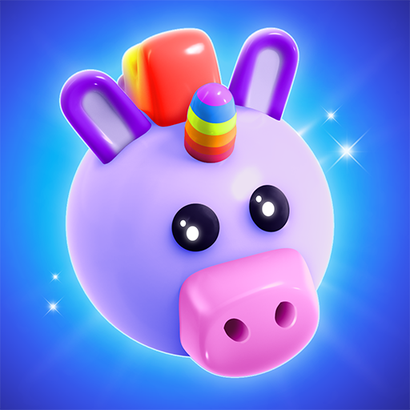
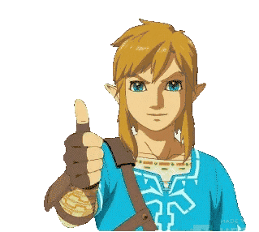
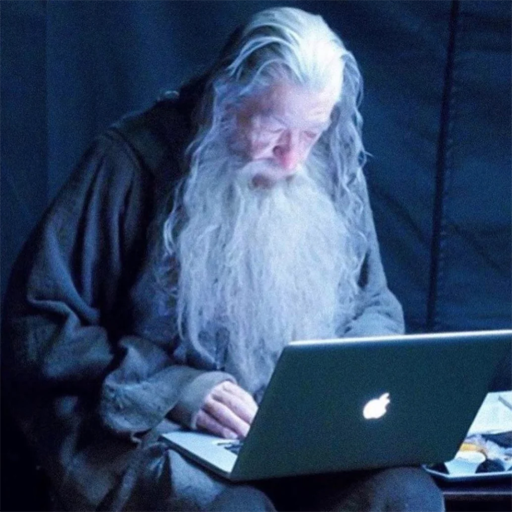

     
## 👋 Hi there, come on in!
  

I'm Gulnaz! 🎮 A Passionate Game Developer & Gamer

 

<table>
  <tr>
    <th>Last Project</th>
    <th>Favourite Game</th>
    <th>Tech Stack</th>
    <th>Socials</th>
  </tr>
  <tr>
    <td align="center">
      <a href="https://play.google.com/store/apps/details?id=gs.revel.matchjourney&hl=tr">
          
        <em>Match Journey 3D</em>
      </a>
    </td>
    <td align="center">
        
      <em>Zelda - Breath of The Wild</em>
    </td>
    <td align="center">
       
      
    </td>
    <td align="center">
       
       
      
    </td>
  </tr> 
</table>

<!--
**gulnazgurbuz/gulnazgurbuz** is a ✨ _special_ ✨ repository because its `README.md` (this file) appears on your GitHub profile.

Here are some ideas to get you started:
        
- 🔭 I’m currently working on ...
- 🌱 I’m currently learning ...
- 👯 I’m looking to collaborate on ...
- 🤔 I’m looking for help with ...
- 💬 Ask me about ...
- 📫 How to reach me: ...
- 😄 Pronouns: ...
- ⚡ Fun fact: ...
-->
